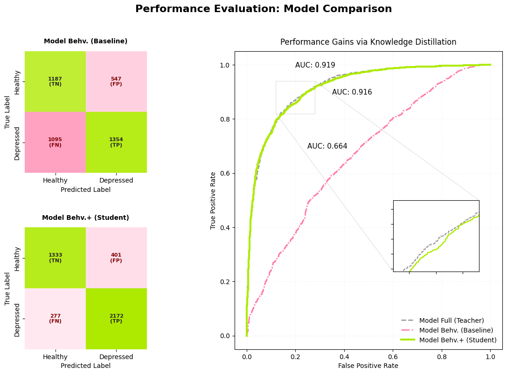
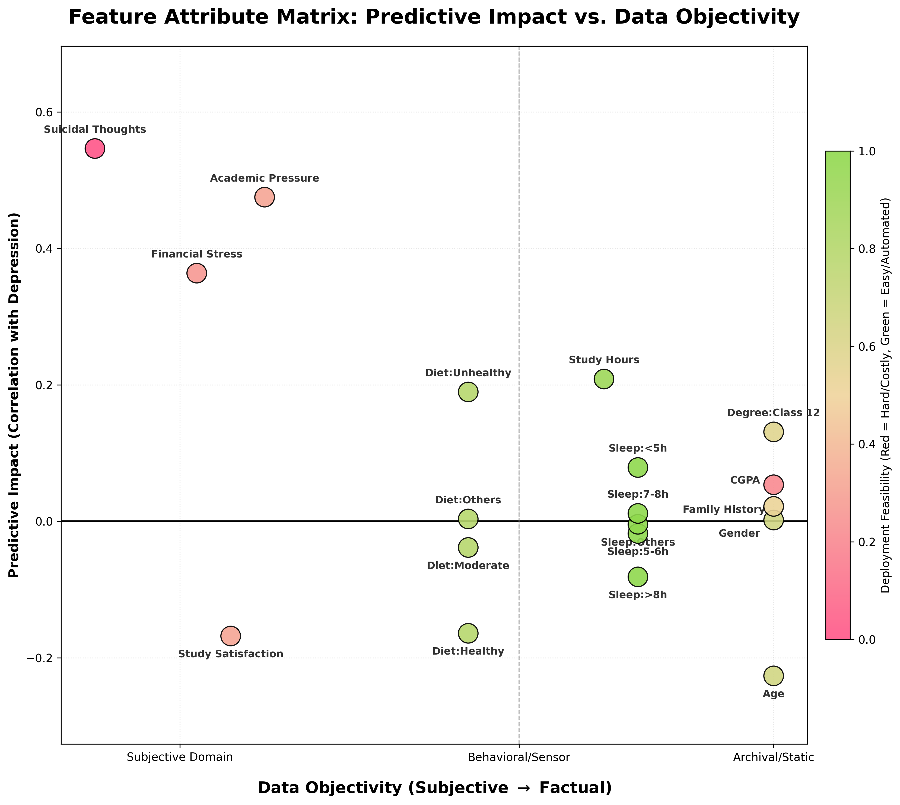
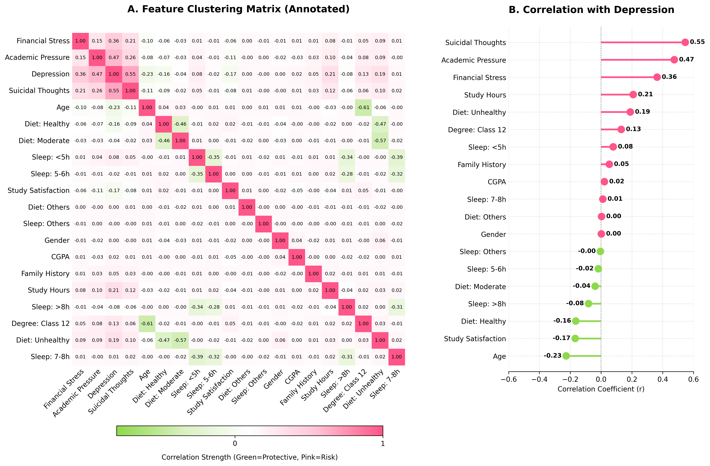
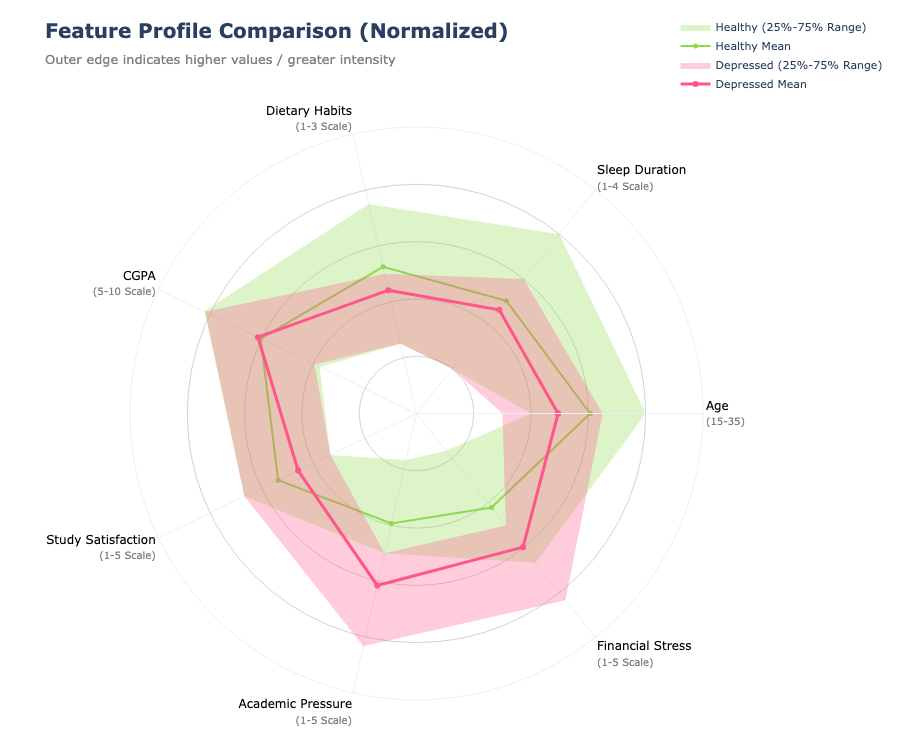
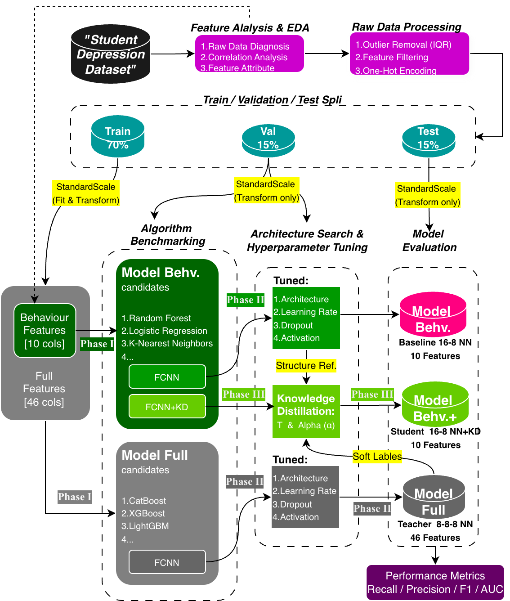
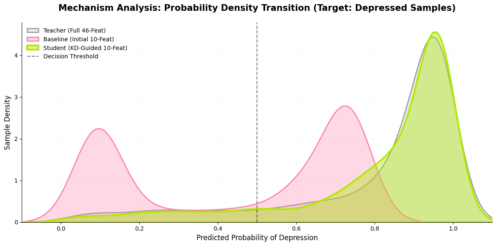
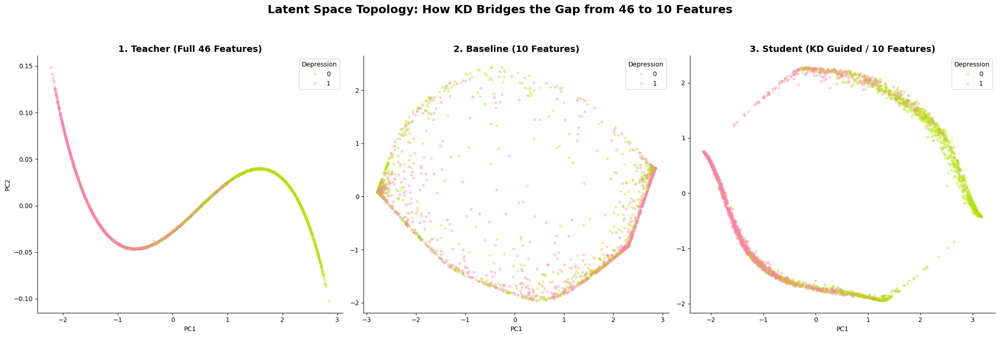

# Non-Intrusive Student Depression Screening via Objective Behavioral Markers 🙍


> **CA6001 – Applied AI Algorithms Project · NTU CCDS (MCAAI)**
> A resource-efficient depression-screening pipeline that uses **Knowledge Distillation** to match a 46-feature model while reading **only 10 objective behavioral markers** — making early screening cheap, privacy-preserving, and deployable on edge devices.

---

## 📌 The Problem

Student depression is usually assessed through **clinical interviews** or **self-reported questionnaires (e.g., [PHQ-9](assets/patient-health-questionnaire.pdf))**. These are subjective, episodic, and require active participation — so at-risk students are often caught late, or not at all.

**The question this project asks:**
> *Can purely **objective behavioral signals** — sleep, diet, study hours — detect depression risk, even though each signal correlates only weakly with the outcome?*

The catch: behavioral features carry a **weak, dispersed signal** on their own. A model trained on them directly tops out around F1 ≈ 0.62. The full clinical feature set (including sensitive items like suicidal thoughts and financial stress) reaches F1 ≈ 0.87 — but collecting that data is exactly what we want to avoid.

**The solution:** train a powerful **Teacher** on all 46 features, then use **Knowledge Distillation (KD)** to transfer its "reasoning" into a compact **Student** that sees only the 10 behavioral features. The Student recovers almost all of the Teacher's performance — without ever touching sensitive data.

---

## 🏆 Headline Result (Unseen Test Set)



| Model | Role | Input Features | F1 | Recall | AUC |
| :--- | :--- | :--- | :--- | :--- | :--- |
| **Teacher** (upper bound) | Full model | 46 (incl. sensitive) | 0.867 | 0.876 | **0.919** |
| Student — *baseline* | Behavioral only | 10 | 0.623 | 0.553 | 0.664 |
| **Student — distilled 🌟** | Behavioral only | **10** | **0.865** | **0.887** | **0.916** |

> Knowledge Distillation lifts the behavioral model by **+39% F1** and **+60% recall** on the held-out test set — closing the gap to the full-feature Teacher while using *zero* sensitive inputs.

A key finding: the baseline (no KD) **overfits noise** and its recall collapses to 55% on unseen data, whereas the distilled student stays stable at ~89%. **KD here behaves as a strong regularizer**, not just a compression trick.

---

## 🔍 Exploratory Data Analysis & Feature Selection

Which features are worth deploying? I scored every feature on **predictive impact** vs **data objectivity / collection cost** — the behavioral signals (sleep, diet, study hours) sit in the "easy-to-measure, non-sensitive" zone, while the strongest predictors (suicidal thoughts, academic pressure) are exactly the sensitive items we want to avoid collecting.



This frames the core tension: the **most objective behavioral features carry only a weak, dispersed signal**. The correlation analysis confirms it — behavioral features correlate weakly with depression (|r| ≈ 0.2), while the high-signal features are the sensitive ones.

<table>
<tr>
<td width="50%"></td>
<td width="50%"></td>
</tr>
</table>

The radar plot shows healthy vs depressed profiles overlap heavily on behavioral axes — there is *signal*, but it's subtle and non-linear. ([Raw-data diagnosis of all feature distributions](assets/07_raw_data_diagnosis.png) drove the cleaning and one-hot encoding decisions.) This is precisely why a model trained directly on these features underperforms — and why Knowledge Distillation is needed to recover the lost performance.

---

## 🔬 How It Works — A Progressive 3-Phase Framework



**Phase I — Algorithmic Benchmarking & Feature Diagnosis.**
Benchmarked classical models (Random Forest, CatBoost, LogReg, KNN, LinearSVC) on both feature sets. Behavioral-only models plateaued (F1 ≈ 0.72), while a LinearSVC on the full set hit recall ≈ 0.89 — evidence of a **latent high-dimensional decision boundary** (Cover, 1965) that linear/behavioral models can't reach. This motivated neural networks + distillation.

**Phase II — Deep-Learning Baselines & Teacher/Student Setup.**
Architecture search yielded a **Teacher (8-8-8-1, 46 feats, AUC 0.926)** and a best **Student (16-8-1, 10 feats, F1 0.727)**. Crucially, no student architecture broke past F1 ≈ 0.72 — confirming the bottleneck is **information in the features, not model capacity**.

**Phase III — Knowledge Distillation.**
A custom loss blends the ground-truth label with the Teacher's *softened* probabilities (Hinton, Vinyals & Dean, 2015):

$$L = (1-\alpha)\cdot L_{\text{hard}} + \alpha \cdot T^2 \cdot L_{\text{soft}}$$

Best config: **T = 10, α = 0.1**. Implementation: [`src/distillation_loss.py`](src/distillation_loss.py).

### What did KD actually transfer?



The baseline (pink) spreads depressed samples across the threshold — many false negatives. After distillation, the student (green) **shifts its probability mass to mirror the Teacher (grey)**, confidently separating the at-risk class.

Looking at the **latent space** makes the transfer even clearer:



A PCA projection of each model's internal representation shows the baseline (10 features) collapses into a tangled blob with no clean class separation. The distilled student instead **recovers a smooth, curved manifold that echoes the Teacher's** — even though it sees only the 10 behavioral features. Distillation transferred the Teacher's *decision geometry* (its "reasoning structure"), not just its labels.

---

## 🚀 From Model to Deployment — A Two-Phase Screening Strategy

The distilled student is tuned for **high recall** (lowering the threshold to τ = 0.4 raises recall to ~0.92) so it works as a **continuous, low-cost first-pass screen** (e.g., from wearable / app data). Anything it flags is escalated to the **high-precision Teacher / clinical review**. Sensitivity where it's cheap; precision where it matters.

---

## 📊 Dataset

- **Source:** [Student Depression Dataset](https://www.kaggle.com/datasets/hopesb/student-depression-dataset) (Kaggle). *Originally published by Adil Shamim; that page is no longer available, so this links to a mirror of the identical 27,901-record dataset.*
- **Size:** 27,901 records → 27,884 after outlier removal (IQR) and feature filtering.
- **Behavioral features (Student input, 10 cols after one-hot):** Sleep Duration, Dietary Habits, Work/Study Hours.
- **Full features (Teacher input, 46 cols after one-hot):** the above + CGPA, Academic Pressure, Study Satisfaction, Financial Stress, Family History, Suicidal Thoughts, Age, Gender, etc.

> ⚠️ The dataset is **not redistributed in this repo** — download it from the Kaggle link above and place the CSV where the notebooks expect it.

---

## 🗂️ Repository Structure

```
.
├── notebooks/
│   ├── 01_EDA_Preprocessing.ipynb        # cleaning, outlier removal, one-hot, EDA
│   ├── 02_Model_Training_Full.ipynb      # Teacher: benchmarks + 46-feature NN search
│   ├── 02_Model_Training_Baseline.ipynb  # Student baseline: 10-feature benchmarks + NN
│   ├── 02_Model_Training_Distill.ipynb   # Knowledge Distillation training
│   ├── 03_Results_Viz_Analysis.ipynb     # all result figures + threshold analysis
│   └── 04_Presentation.ipynb             # interactive Gradio demo
├── src/
│   └── distillation_loss.py              # custom KD loss + student model builder
├── assets/                               # EDA + result figures (used in this README)
├── requirements.txt
└── LICENSE
```

## ⚙️ Reproduce

```bash
git clone https://github.com/<your-username>/CA6001_Student-Depression.git
cd CA6001_Student-Depression
pip install -r requirements.txt
```

1. Download the dataset from Kaggle (link above) and update the data path at the top of the notebooks (originally Google Colab / Drive paths).
2. Run the notebooks in order: `01 → 02_Full → 02_Baseline → 02_Distill → 03`.
3. Trained model weights are **not** committed; the notebooks regenerate them.

## 🛠️ Tech Stack

`TensorFlow / Keras` · `scikit-learn` · `XGBoost / LightGBM / CatBoost` · `imbalanced-learn (SMOTE)` · `pandas / NumPy` · `Matplotlib / Seaborn` · `Gradio`

---

## ⚖️ Disclaimer

This is an **academic coursework project**. The models are research prototypes trained on a public dataset and are **not validated for, and must not be used for, real clinical diagnosis or any medical decision-making.**

## 📄 License

Released under the [MIT License](LICENSE).
